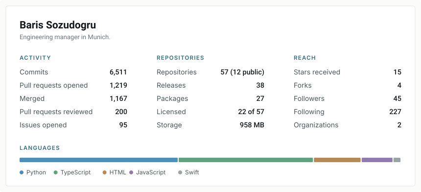

### Baris Sozudogru

Engineering manager in Munich. Still building.

Small developer tools, each doing one thing. No runtime dependencies, MIT licensed, installable with npx.

| Tool | What it does |
|---|---|
| [gha-cost](https://github.com/barissozudogru/gha-cost) | Estimates GitHub Actions cost from the workflow YAML, reading the cron schedule and cache declaration. Reports a range rather than a false point estimate. |
| [dep-health](https://github.com/barissozudogru/dep-health) | Scores npm dependency health. An unavailable signal is dropped from the average rather than counted as zero. |
| [envdrift](https://github.com/barissozudogru/envdrift) | Compares .env files across environments. Describes each value by length and fingerprint instead of printing it. |
| [docker-context-scout](https://github.com/barissozudogru/docker-context-scout) | Finds what is inflating a Docker build context and writes rules that actually exclude it. |
| [healthcheck-gen](https://github.com/barissozudogru/healthcheck-gen) | Writes a HEALTHCHECK using a probe the base image can run, rather than assuming curl is installed. |
| [gha-secrets-audit](https://github.com/barissozudogru/gha-secrets-audit) | Audits Actions workflows for over-exposed secrets. Runs offline and never reads a secret. |
| [portscan-dev](https://github.com/barissozudogru/portscan-dev) | Shows what is holding a development port and can free it. |

Three Model Context Protocol servers, published to the [official MCP Registry](https://registry.modelcontextprotocol.io):
[gha-intel](https://github.com/barissozudogru/gha-intel-mcp) for workflow timing and billing,
[test-intel](https://github.com/barissozudogru/test-intel-mcp) for coverage and complexity,
[release-intel](https://github.com/barissozudogru/release-intel-mcp) for correlating commits and pull requests between refs.

[synfire](https://github.com/barissozudogru/synfire) is research code: Forward-Forward and Hebbian competitive learning for time series anomaly detection.
